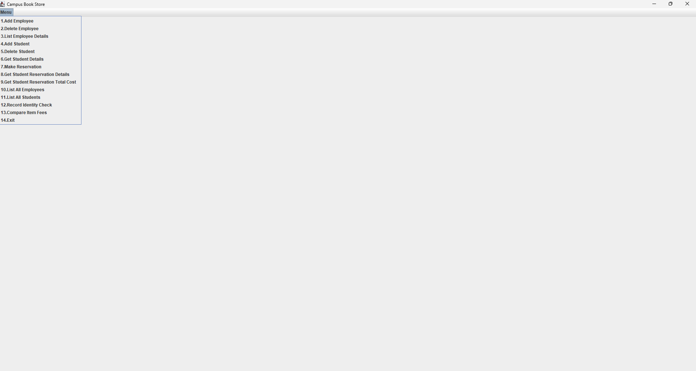
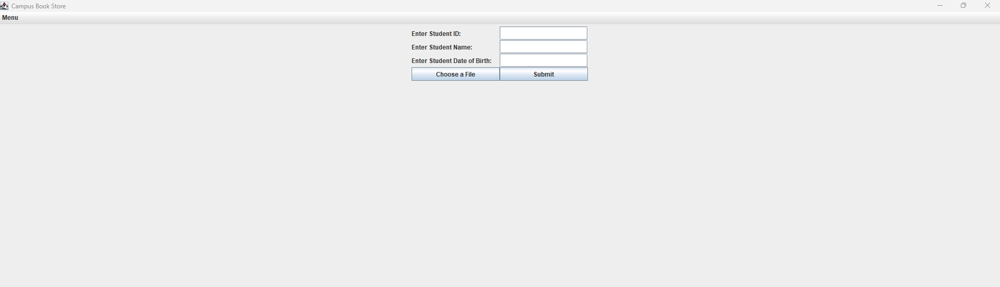
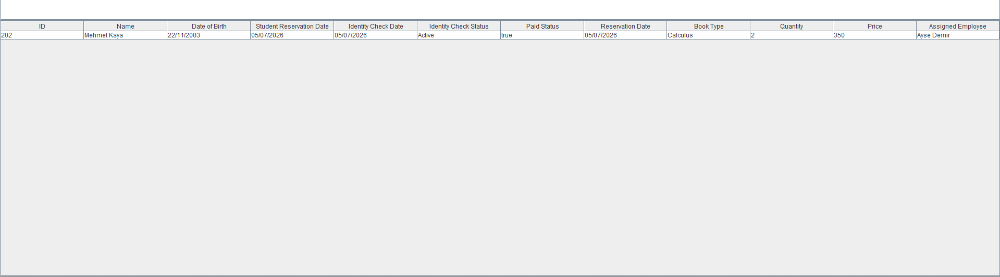
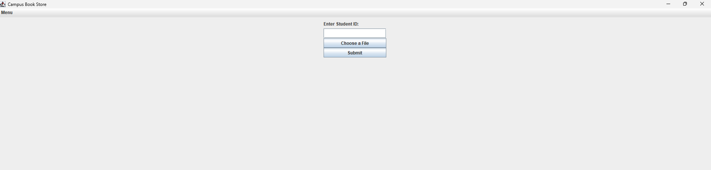
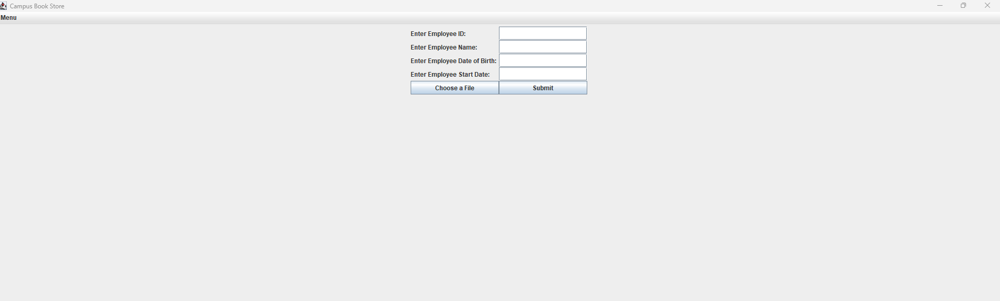
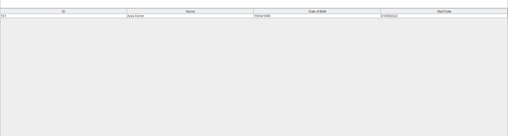
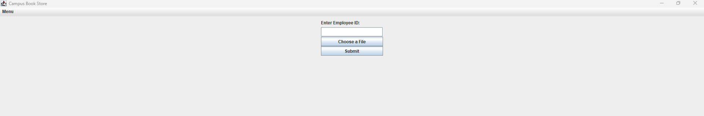
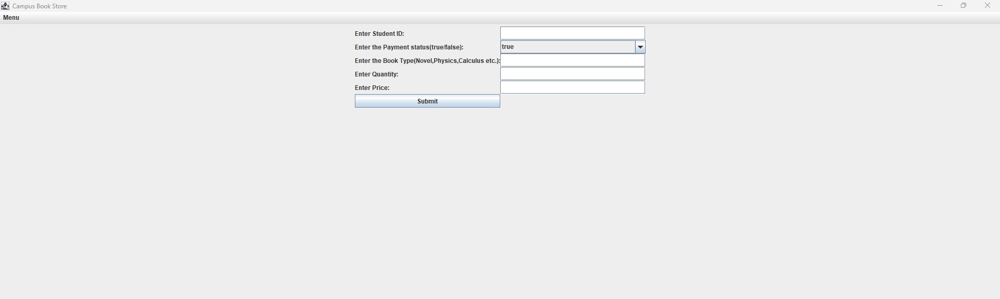
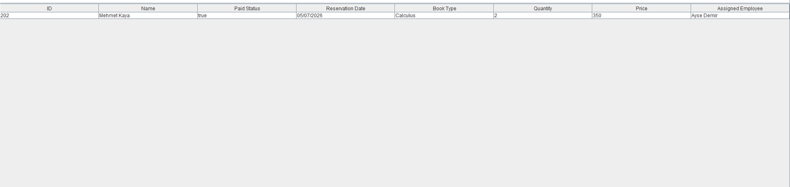

# Campus Book Store Application

A Java object-oriented programming project that simulates a campus bookstore management system. The system manages employees, students, textbook reservations, book items, reservation costs, identity checks, and student loyalty comparisons.

This project includes both a command-line version and a Swing-based graphical user interface version.

## Project Overview

The Campus Book Store system allows users to manage bookstore records such as employees, students, and textbook reservations. Students can make reservations for different book items, and each reservation stores book type, quantity, price, payment status, reservation date, and assigned employee information.

The project demonstrates core Java OOP concepts such as inheritance, abstraction, interfaces, encapsulation, collections, file handling, and GUI programming.

## Features

* Add, delete, and list employees
* Add, delete, and list students
* View details of a specific employee or student
* Make textbook reservations for students
* Store multiple book items inside a reservation
* Calculate total reservation cost
* Assign employees to reserved book items
* Record student identity checks
* Compare students based on loyalty
* Save and load employee/student data using binary files
* Use both CLI and Swing GUI interfaces

## Technologies Used

* Java
* Java Swing
* Java AWT
* Object-Oriented Programming
* File I/O
* Collections Framework

  * `ArrayList`
  * `HashMap`
* Date handling with `SimpleDateFormat`

## Project Structure

```text
CampusBookStorewithInterface/
├── BookItem.java
├── CampusBookStore.java
├── CampusBookStoreGUI.java
├── Employee.java
├── Student.java
├── StudentLoyalty.java
├── TextbookReservation.java
├── User.java
└── README.md
```

## Class Descriptions

### `User.java`

An abstract base class that stores common user information:

* ID
* Name
* Date of birth

Both `Employee` and `Student` inherit from this class.

### `Employee.java`

Represents a bookstore employee. It extends `User` and adds:

* Employee start date
* Employee detail printing functionality

### `Student.java`

Represents a student. It extends `User`, implements `Comparable`, and implements `StudentLoyalty`.

A student stores:

* Reservation date
* List of reservations
* Identity check records
* Loyalty calculation based on reserved book quantity

### `StudentLoyalty.java`

An interface used to calculate student loyalty.

```java
public interface StudentLoyalty {
    int MIN_TOTAL_QUANTITY = 0;
    double calculateTotalQuantity();
}
```

The `Student` class implements this interface to calculate the total number of reserved books.

### `BookItem.java`

Represents a single book item inside a reservation.

Each book item stores:

* Book type
* Quantity
* Price
* Assigned employee

It also calculates the total cost of a book item.

### `TextbookReservation.java`

Represents a textbook reservation made by a student.

Each reservation stores:

* Reservation date
* List of book items
* Payment status

It can calculate the total cost of all reserved book items.

### `CampusBookStore.java`

The command-line version of the bookstore system.

It provides menu options for:

* Employee management
* Student management
* Reservation management
* Identity checks
* Loyalty comparison
* File reading and writing

### `CampusBookStoreGUI.java`

The graphical user interface version of the bookstore system.

It uses Java Swing components such as:

* `JFrame`
* `JMenuBar`
* `JMenuItem`
* `JPanel`
* `JButton`
* `JTextField`
* `JTable`
* `JFileChooser`
* `JOptionPane`

The GUI allows users to interact with the bookstore system through menu options instead of the terminal.

## OOP Concepts Used

### Inheritance

`Employee` and `Student` both extend the abstract `User` class.

```text
User
├── Employee
└── Student
```

### Abstraction

`User` is an abstract class that stores common fields for different user types.

### Interface Implementation

`Student` implements the `StudentLoyalty` interface.

This allows the system to calculate loyalty based on the total quantity of books reserved by a student.

### Encapsulation

Class fields are kept private or protected where appropriate, and they are accessed through getter and setter methods.

### Collections

The project uses Java collections to store dynamic data:

* `ArrayList<Employee>` for employees
* `ArrayList<Student>` for students
* `ArrayList<TextbookReservation>` for reservations
* `ArrayList<BookItem>` for book items
* `HashMap<Date, String>` for student identity checks

### File Handling

The project uses binary file handling to save and load employee and student data.

Used classes include:

* `File`
* `FileInputStream`
* `FileOutputStream`
* `DataInputStream`
* `DataOutputStream`
* `BufferedInputStream`
* `BufferedOutputStream`

## How to Run

### 1. Compile the project

Because the files use the package name `campusbookstore`, compile them with:

```bash
javac -d . *.java
```

### 2. Run the CLI version

```bash
java campusbookstore.CampusBookStore
```

### 3. GUI Version

The project also includes a Swing GUI implementation in `CampusBookStoreGUI.java`.

To run the GUI directly, create a small launcher class or call the `menu()` method from your IDE.

Example launcher:

```java
package campusbookstore;

public class MainGUI {
    public static void main(String[] args) {
        CampusBookStoreGUI gui = new CampusBookStoreGUI();
        gui.menu();
    }
}
```

Then compile and run:

```bash
javac -d . *.java
java campusbookstore.MainGUI
```

## Interfaces

This section is reserved for screenshots of the application interfaces.

Create an `images` folder inside this project and upload your screenshots there. Then update the image paths below if needed.

## Interfaces

This section contains screenshots of the main application interfaces.

### Main Menu



### Add Student



### List All Students



### Delete Student



### Add Employee



### List All Employees



### Delete Employee



### Make Reservation



### Student Reservation Details



### Loyalty Comparison


## Example Use Cases

1. Add employees to the bookstore system.
2. Add students who can make textbook reservations.
3. Create reservations for students by entering book type, quantity, price, and payment status.
4. Assign employees to book items.
5. View reservation details for a specific student and date.
6. Calculate the total cost of a student's reservations.
7. Record identity check information for students.
8. Compare students based on their total reserved book quantity.
