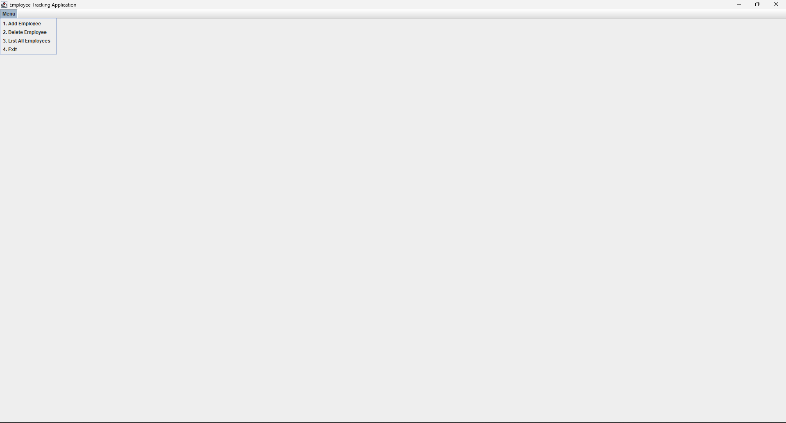
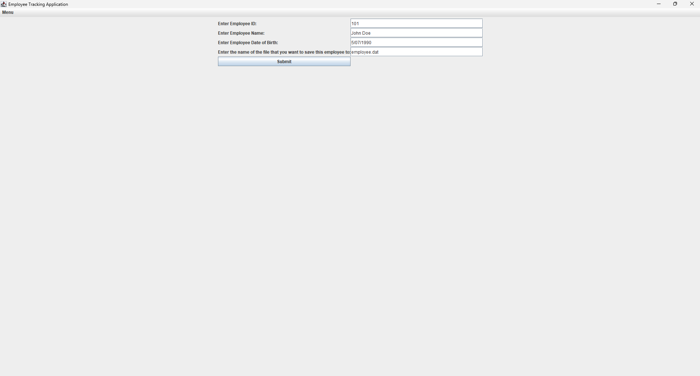
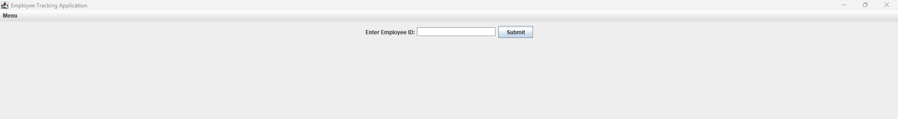
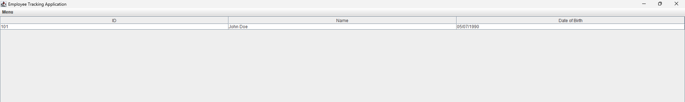

# Employee Tracking Application

This is a Java Swing project that demonstrates a simple **Employee Tracking Application**.

The application allows users to manage employee records through a graphical user interface. Employees can be added, listed in a table, and saved to a binary data file using Java object serialization.

## Project Overview

The purpose of this project is to practice Java GUI programming and file handling together in a small employee management system.

The program uses a menu-based Swing interface with options for:

* Adding an employee
* Deleting an employee
* Listing all employees
* Exiting the application

Employee data includes:

* Employee ID
* Employee name
* Employee date of birth

## Technologies Used

* Java
* Java Swing
* Java AWT
* Object-Oriented Programming
* Serialization
* File I/O
* `ArrayList`
* `JTable`
* `DefaultTableModel`
* `ObjectInputStream`
* `ObjectOutputStream`

## Project Structure

```text id="cjoxf5"
FinalStudies/
├── Final.java
└── README.md
```

## Main Features

### Add Employee

The user can add a new employee by entering:

* Employee ID
* Employee name
* Employee date of birth
* File name to save employee data

The employee is then added to the employee list and saved to a file.

### Delete Employee

The application contains a delete employee interface where the user can enter an employee ID.

This part is useful for practicing GUI form creation. The current version displays the delete employee form, but the actual deletion logic can be extended further.

### List All Employees

The application lists all employees in a table.

The table displays:

* ID
* Name
* Date of birth

### Save Employees to File

Employee objects are saved using object serialization.

The program uses:

```java id="xen6ls"
ObjectOutputStream
FileOutputStream
BufferedOutputStream
```

### Read Employees from File

When the program starts, it reads employee records from the `employee.dat` file if it exists.

The program uses:

```java id="z6niev"
ObjectInputStream
FileInputStream
BufferedInputStream
```

## Class Description

### `Final.java`

This is the main class of the project.

It contains:

* The `Employee` inner class
* The employee list
* GUI menu creation
* Add employee interface
* Delete employee interface
* List employees interface
* Save and read file methods
* Main method

### `Employee`

The `Employee` class stores employee information.

It contains:

* `id`
* `name`
* `dateOfBirth`

The class implements `Serializable`, which allows employee objects to be written to and read from files.

## GUI Menu Options

The application menu contains these options:

```text id="hlly2z"
1. Add Employee
2. Delete Employee
3. List All Employees
4. Exit
```

## Interfaces

This section is reserved for screenshots of the application interfaces.

Create an `images` folder inside the `FinalStudies` folder and upload your screenshots there.

Recommended folder structure:

```text id="okgg5a"
FinalStudies/
├── images/
│   ├── main-menu.png
│   ├── add-employee.png
│   ├── delete-employee.png
│   └── list-all-employees.png
├── Final.java
└── README.md
```

### Main Menu



### Add Employee Interface



### Delete Employee Interface



### List All Employees Interface



## How to Run

### 1. Compile the Java file

```bash id="p3srb7"
javac Final.java
```

### 2. Run the program

```bash id="qd4plp"
java Final
```

## Example Usage

1. Run the program.
2. The welcome message is displayed.
3. Open the menu.
4. Select **Add Employee**.
5. Enter employee ID, name, date of birth, and file name.
6. Select **List All Employees** to view employees in a table.
7. Select **Delete Employee** to open the delete employee form.
8. Select **Exit** to close the application.

## Date Format

Employee date of birth should be entered in this format:

```text id="ngf6rz"
dd/MM/yyyy
```

Example:

```text id="crq389"
15/04/2002
```

## OOP Concepts Used

### Encapsulation

Employee data is stored inside the `Employee` class and accessed through getter and setter methods.

### Inner Class

The `Employee` class is written inside the `Final` class as a static inner class.

### Serialization

The `Employee` class implements `Serializable`, allowing employee objects to be saved to a file.

### Collections

The project uses an `ArrayList<Employee>` to store employee records dynamically.

### GUI Programming

The project uses Java Swing components such as:

* `JFrame`
* `JMenuBar`
* `JMenu`
* `JMenuItem`
* `JPanel`
* `JLabel`
* `JTextField`
* `JButton`
* `JTable`
* `JScrollPane`
* `JOptionPane`

## Possible Improvements

* Complete the delete employee button logic
* Add input validation for empty fields
* Show success and error messages after operations
* Prevent duplicate employee IDs
* Add update employee functionality
* Improve the GUI layout and window size
* Separate the `Employee` class into its own file
